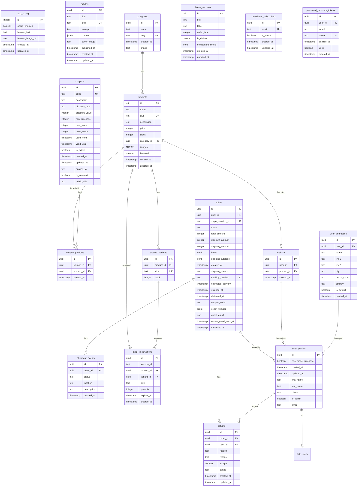

# Database Entity-Relationship Schema

This diagram illustrates the structure of the database retrieved from the Supabase MCP.

```mermaid
erDiagram
    app_config {
        integer id PK
        boolean offers_enabled
        text banner_text
        text banner_image_url
        timestamp created_at
        timestamp updated_at
    }

    articles {
        uuid id PK
        text title
        text slug UK
        text excerpt
        jsonb content
        text cover_image
        timestamp published_at
        timestamp created_at
        timestamp updated_at
    }

    categories {
        uuid id PK
        text name
        text slug UK
        timestamp created_at
        text image
    }

    coupon_products {
        uuid id PK
        uuid coupon_id FK
        uuid product_id FK
        timestamp created_at
    }

    coupons {
        uuid id PK
        text code UK
        text description
        text discount_type
        integer discount_value
        integer min_purchase
        integer max_uses
        integer uses_count
        timestamp valid_from
        timestamp valid_until
        boolean is_active
        timestamp created_at
        timestamp updated_at
        text applies_to
        boolean is_automatic
        text public_title
    }

    home_sections {
        uuid id PK
        text key
        text label
        integer order_index
        boolean is_visible
        jsonb component_config
        timestamp created_at
        timestamp updated_at
    }

    newsletter_subscribers {
        uuid id PK
        text email UK
        boolean is_active
        timestamp created_at
        timestamp updated_at
    }

    orders {
        uuid id PK
        uuid user_id FK
        text stripe_session_id UK
        text status
        integer total_amount
        integer discount_amount
        integer shipping_amount
        jsonb items
        jsonb shipping_address
        timestamp created_at
        text shipping_status
        text tracking_number UK
        timestamp estimated_delivery
        timestamp shipped_at
        timestamp delivered_at
        text coupon_code
        bigint order_number
        text guest_email
        timestamp review_email_sent_at
        timestamp cancelled_at
    }

    password_recovery_tokens {
        uuid id PK
        uuid user_id FK
        text email
        text token UK
        timestamp expires_at
        boolean used
        timestamp created_at
    }

    product_variants {
        uuid id PK
        uuid product_id FK
        text size UK
        integer stock
    }

    products {
        uuid id PK
        text name
        text slug UK
        text description
        integer price
        integer stock
        uuid category_id FK
        ARRAY images
        boolean featured
        timestamp created_at
        timestamp updated_at
    }

    returns {
        uuid id PK
        uuid order_id FK
        uuid user_id FK
        text reason
        text details
        ARRAY images
        text status
        timestamp created_at
        timestamp updated_at
    }

    shipment_events {
        uuid id PK
        uuid order_id FK
        text status
        text location
        text description
        timestamp created_at
    }

    stock_reservations {
        uuid id PK
        text session_id
        uuid product_id FK
        uuid variant_id FK
        text size
        integer quantity
        timestamp expires_at
        timestamp created_at
    }

    user_addresses {
        uuid id PK
        uuid user_id FK
        text name
        text line1
        text line2
        text city
        text postal_code
        text country
        boolean is_default
        timestamp created_at
    }

    user_profiles {
        uuid id PK
        boolean has_made_purchase
        timestamp created_at
        timestamp updated_at
        text first_name
        text last_name
        text phone
        boolean is_admin
        text email
    }

    wishlists {
        uuid id PK
        uuid user_id FK
        uuid product_id FK
        timestamp created_at
    }

    %% Relationships
    categories ||--o{ products : "has"
    products ||--o{ product_variants : "has"
    products ||--o{ coupon_products : "included in"
    coupons ||--o{ coupon_products : "has"
    products ||--o{ stock_reservations : "reserved"
    product_variants ||--o{ stock_reservations : "reserved"
    products ||--o{ wishlists : "favorited"
    orders ||--o{ returns : "has"
    user_profiles ||--o{ returns : "makes"
    orders ||--o{ shipment_events : "has"

    %% Implicit associations with Auth Users
    user_profiles ||--o| "auth.users" : "is"
    orders ||--o{ user_profiles : "placed by"
    wishlists ||--o{ user_profiles : "belongs to"
    user_addresses ||--o{ user_profiles : "belongs to"

```
